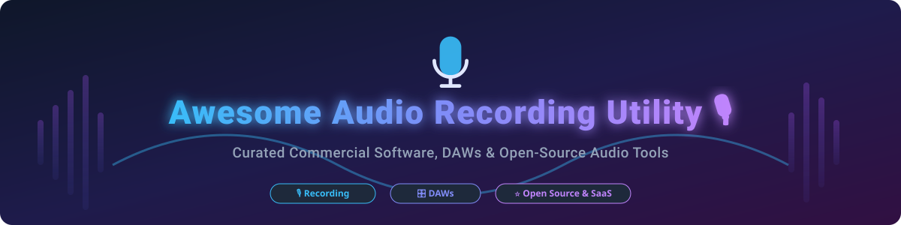

# Awesome Audio Recording Utility 🎙️

  

  
  
  
  
  

> **A curated list of top-tier Commercial Audio Software, SaaS Audio Recording Platforms, and Open-Source GitHub Projects.**
> 
> *Focused on Audio Recording, Multitrack Editing, Voice Notes, Podcast Production, & Digital Audio Workstations (DAWs).*

---

## 📑 Table of Contents
- [📊 Market & Industry Insights](#-market--industry-insights)
- [💼 Commercial & SaaS Software](#-commercial--saas-software)
- [⭐ Open-Source GitHub Projects](#-open-source-github-projects)
  - [🎛️ Full-Featured DAWs & Editors](#️-full-featured-daws--editors)
  - [🎧 Voice Recorders & Specialized Utilities](#-voice-recorders--specialized-utilities)
  - [⚡ Audio Engines, Libraries & CLI Tools](#-audio-engines-libraries--cli-tools)
- [🤝 Support & Sponsorship](#-support--sponsorship)
- [📈 Star History](#-star-history)
- [🤝 How to Contribute](#-how-to-contribute)
- [⚠️ Disclaimer](#️-disclaimer)

---

## 📊 Market & Industry Insights

> 💡 **Market Size & Structure**: The global audio editing and recording software market is estimated at **~$4.2 Billion** (2026), driven by the rapid growth of podcasting, remote collaboration, video creation, and music production. The market is **moderately fragmented**: enterprise tech conglomerates (Microsoft, Apple, Adobe) dominate pre-installed and professional post-production suites, while specialized SaaS tools (Descript, Riverside.fm) capture creator workflows, and mature open-source solutions (Audacity, OBS Studio, Ardour) form an indispensable foundation across the industry.

---

## 💼 Commercial & SaaS Software

Below is a structured breakdown of commercial audio recording utilities and SaaS platforms, sorted by **Company Revenue / Valuation (Descending)**:

| Product 🛠️ | Pricing Tier 💳 | Free Tier / Trial Limit ⏳ | Company Revenue / Valuation 📈 | Key Description 📝 |
| :--- | :--- | :--- | :--- | :--- |
| **[Microsoft Windows Voice Recorder](https://www.microsoft.com/en-us/p/windows-voice-recorder/9nblggh6jjbm)** | Free (Included with OS) | Unlimited free pre-installed utility | **~$245 Billion Revenue** (Microsoft) | Native Windows voice recording app for quick dictation, trim, and audio clip sharing. |
| **[Apple Voice Memos](https://www.apple.com/ios/voice-memos/)** | Free (Included with OS) | Unlimited free pre-installed utility | **~$385 Billion Revenue** (Apple) | Built-in iOS and macOS recording app with iCloud sync, automatic skip silence, and speech enhancement. |
| **[Apple GarageBand](https://www.apple.com/mac/garageband/)** | Free (Included with OS) | Unlimited free macOS / iOS software | **~$385 Billion Revenue** (Apple) | Intuitive music creation workstation featuring multitrack recording, virtual instruments, and audio loops. |
| **[Adobe Audition](https://www.adobe.com/products/audition.html)** | $22.99 / month | 7-day full-featured free trial | **~$19.4 Billion Revenue** (Adobe) | Professional digital audio workstation for recording, mixing, audio restoration, and podcast post-production. |
| **[Descript](https://www.descript.com/)** | $12.00 / month | Free Forever: 1 hr/mo transcription, 1 watermark-free video export (720p) | **~$575 Million Valuation** | AI-powered audio and video recording editor that lets users edit audio by editing transcript text. |
| **[Riverside.fm](https://riverside.fm/)** | $15.00 / month | Free Forever: 2 hours of single-track video/audio recording | **~$350 Million Valuation** | Studio-quality remote podcast and video recording platform with local track recording. |
| **[Sound Forge](https://www.magix.com/us/music/sound-forge/)** | $49.99 one-time (Pro $399) | 30-day free trial | **~$50 Million Revenue** (MAGIX) | High-precision audio editing, mastering, and restoration suite for Windows audio engineers. |
| **[WavePad](https://www.nch.com.au/wavepad/)** | $3.88 / month (or $60 lifetime) | Free version available for non-commercial personal use | **~$15 Million Revenue** (NCH Software) | Lightweight audio editor featuring multi-format support, voice effects, and spectral analysis. |
| **[GoldWave](https://www.goldwave.com/)** | $19.00 / year (or $59 lifetime) | Fully functional evaluation version (limited to 3,000 commands per session) | **~$5 Million Revenue** | Comprehensive digital audio editor and recorder for Windows with batch processing. |
| **[RecordPad](https://www.nch.com.au/recordpad/)** | $29.99 one-time | 14-day free trial | **~$15 Million Revenue** (NCH Software) | Simple dictation and voice recording utility supporting MP3, WAV, and automatic voice activation. |

---

## ⭐ Open-Source GitHub Projects

The open-source audio ecosystem is exceptionally mature, production-proven, and actively maintained. Projects below are sorted by **GitHub_Stars (Descending)**.

### 🎛️ Full-Featured DAWs & Editors

- **[OBS Studio](https://github.com/obsproject/obs-studio)** 
  - **Description**: The industry-standard open-source video and audio recording and live streaming software. Features multi-channel audio mixing, noise suppression, VST plugin filters, and low-latency audio capture. 🎙️📹
  - **License**: GPL-2.0 | **Platforms**: Windows, macOS, Linux

- **[Audacity](https://github.com/audacity/audacity)** 
  - **Description**: World-famous multi-track audio editor and recorder. Supports non-destructive editing, spectrogram analysis, noise reduction, VST/LV2 plugins, and extensive file format exporting. 🎧
  - **License**: GPL-2.0 | **Platforms**: Windows, macOS, Linux

- **[LMMS](https://github.com/LMMS/lmms)** 
  - **Description**: Cross-platform music production environment enabling beat creation, synthesizer sequencing, MIDI playback, and VST plugin hosting. 🎼
  - **License**: GPL-2.0 | **Platforms**: Windows, macOS, Linux

- **[Ardour](https://github.com/Ardour/ardour)** 
  - **Description**: Professional digital audio workstation (DAW) designed for recording, mixing, and mastering multi-track sessions with full automation and JACK/PipeWire routing support. 🎚️
  - **License**: GPL-2.0 | **Platforms**: Linux, macOS, Windows

- **[Tenacity](https://github.com/tenacityteam/tenacity)** 
  - **Description**: Privacy-focused community fork of Audacity without telemetry, tracking, or CLA requirements, retaining full multitrack editing capabilities. 🔒
  - **License**: GPL-2.0 | **Platforms**: Windows, macOS, Linux

- **[Zrythm](https://github.com/zrythm/zrythm)** 
  - **Description**: Modern, high-performance digital audio workstation with a highly responsive GTK4 interface, clip launcher, automation curves, and CLAP/VST3 plugin support. 🚀
  - **License**: AGPL-3.0 | **Platforms**: Linux, macOS, Windows

- **[Ocenaudio](https://github.com/ocenaudio/ocenaudio)** 
  - **Description**: Fast, cross-platform audio editor featuring real-time effect previewing, large file support, and spectrogram analysis. ⏱️
  - **License**: Freeware (Source on GitHub) | **Platforms**: Windows, macOS, Linux

- **[Qtractor](https://github.com/rncbc/qtractor)** 
  - **Description**: C++ / Qt-based multi-track audio and MIDI sequencer designed specifically for Linux audio production setups. 🐧
  - **License**: GPL-2.0 | **Platforms**: Linux

---

### 🎧 Voice Recorders & Specialized Utilities

- **[Whisper.cpp](https://github.com/ggerganov/whisper.cpp)** 
  - **Description**: High-performance C/C++ port of OpenAI's Whisper model for lightweight, real-time local speech-to-text recording transcription. 🤖
  - **License**: MIT | **Platforms**: Cross-platform

- **[Audio Recorder (GNOME)](https://gitlab.gnome.org/World/audio-recorder)** 
  - **Description**: Lightweight audio recorder for Linux GNOME desktop capable of capturing system sound output, microphone input, or web browser audio streams. 🎙️
  - **License**: GPL-3.0 | **Platforms**: Linux

- **[RecordMyDesktop](https://github.com/recordmydesktop/recordmydesktop)** 
  - **Description**: CLI and GUI desktop session recorder with ALSA/JACK audio capture. 🖥️
  - **License**: GPL-2.0 | **Platforms**: Linux

---

### ⚡ Audio Engines, Libraries & CLI Tools

- **[FFmpeg](https://github.com/FFmpeg/FFmpeg)** 
  - **Description**: Complete, cross-platform solution to record, convert, process, and stream audio and video via command-line interface. ⚡
  - **License**: LGPL-2.1 / GPL-2.0 | **Platforms**: Cross-platform

- **[SoX (Sound eXchange)](https://sourceforge.net/projects/sox/)** 
  - **Description**: The "Swiss Army knife" of audio processing utilities. Command-line tool that records audio input, converts formats, and applies effects. 🛠️
  - **License**: GPL-2.0 | **Platforms**: Cross-platform

- **[PortAudio](https://github.com/PortAudio/portaudio)** 
  - **Description**: Portable, open-source audio I/O library giving developers a simple API for recording and playing audio on all major OS platforms. 🔊
  - **License**: MIT | **Platforms**: Cross-platform

---

## 🤝 Support & Sponsorship

If you find this curated list helpful for your audio projects, podcast workflow, or DAW development, please consider supporting the project! 💖

- ⭐ **Star this repository** to help others discover it.
- 🔀 **Fork and contribute** new tools, software, or utilities.
- 📢 **Share** with fellow podcasters, audio engineers, and developers.
- ☕ **Sponsor / Buy a coffee**: Check out the [GitHub Sponsor Dashboard](https://github.com/sponsors/ishandutta2007) to keep this list updated!

---

## 📈 Star History

---

## 🤝 How to Contribute

1. Fork the repository.
2. Add/edit entries in `README.md` following the table or list formats.
3. Ensure descriptions are concise, factual, and include license/pricing details.
4. Submit a Pull Request with a short explanation.

---

## ⚠️ Disclaimer

- This list is **community-curated** for informational and educational purposes.
- Audio recording utilities handle sensitive voice and conversation data; always adhere to privacy regulations and obtain proper recording consent.
